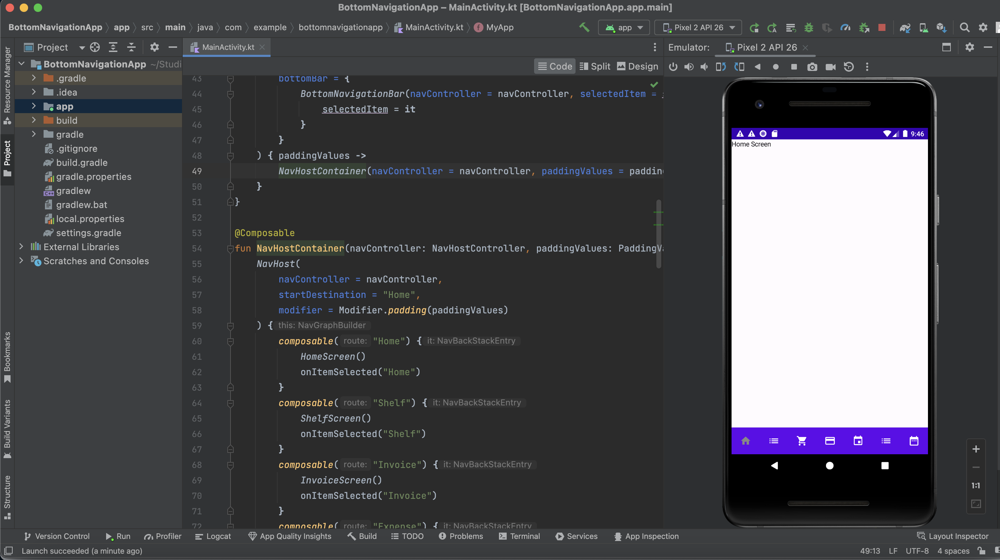

# BottomNavigationApp

A basic native Android application demonstrating navigation between screens using Kotlin and Jetpack Compose. This project replicates a simple architecture with seamless navigation between screens, displaying the name of each screen.

## Features

- Navigation between multiple screens
- Simple UI with Material3 components
- Built using Jetpack Compose

## Architecture

The app architecture consists of a Home screen that navigates to various other screens. Each screen displays its respective name. The architecture is depicted in the provided PNG file.

## Technologies Used

- Kotlin
- Android Studio
- Jetpack Compose
- Material3

## Getting Started

### Prerequisites

- Android Studio (Arctic Fox or later)
- Kotlin 1.7 or later
- Android SDK

### Installation

1. Clone the repository:

   ```bash
   git clone https://github.com/vg-backend-engr/sabisabi_screen_navigation.git
2. Navigate to the project directory: cd sabisabi_screen_navigation

3. Open the project in Android Studio and sync the Gradle files.

4. Run the application on an emulator or physical device.

### Usage 
Once the app is running, you can navigate between the Home screen and other screens using the bottom navigation bar. Each screen will display its name, allowing for easy identification of the current view.

### Screenshot
See the development screeshot at "Screenshot 2024-10-19 at 9.46.40 PM.png" in the root folder.
   

## Contribution 
Feel free to fork the repository and submit pull requests. For major changes, please open an issue first to discuss what you would like to change.

## License 
This project is licensed under the MIT License.

## Acknowledgments 
Thanks to the Jetpack Compose team for their amazing documentation and resources, which made this project possible.
